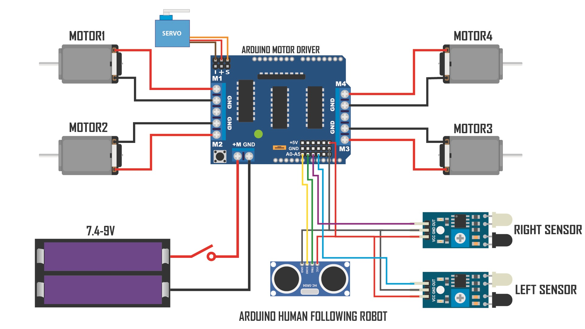

# FollowBot: Arduino-Powered Human Tracker

FollowBot is an autonomous human-following robot car built using the Arduino platform. It utilizes infrared sensors for detecting human presence, an ultrasonic sensor for obstacle detection, and a servo motor for directional adjustments. This project demonstrates the effective integration of readily accessible components to create a functional robotic system capable of following a human target while avoiding obstacles.

## Table of Contents

- [Introduction](#introduction)
- [Getting Started](#getting-started)
  - [Hardware Setup](#hardware-setup)
  - [Software Setup](#software-setup)
- [Components Used](#components-used)
- [Circuit Diagram](#circuit-diagram)
- [Pictures](#pictures)
- [Demo Video](#demo-video)
- [Code Overview](#code-overview)
- [Results](#results)
- [Optional Improvements](#optional-improvements)
- [License](#license)

## Introduction

The primary objective of FollowBot is to design and implement a functional, autonomous human-following robot using the Arduino platform. FollowBot employs infrared sensors to detect human presence, an ultrasonic sensor for obstacle detection, and a servo motor for directional adjustments. The project showcases the potential of affordable technologies like Arduino to create meaningful robotic systems capable of navigating dynamic environments.

## Getting Started

### Hardware Setup

1. Gather the following materials:
   - Arduino Uno
   - Motor driver shield
   - Infrared (IR) sensors
   - Ultrasonic sensor
   - Servo motor
   - DC motors
   - Robot chassis and wheels
   - Power source (battery and battery holder)
   - Jumper wires

2. Connect IR sensors, ultrasonic sensor, servo motor, motors, and the motor driver shield to the Arduino Uno following the provided schematic.

3. Mount IR sensors, ultrasonic sensor, and servo motor on the robot chassis for optimal detection and directional adjustments.

### Software Setup

1. Install the Arduino IDE on your computer if not already installed.

2. Download the Arduino code provided in the repository.

3. Connect the Arduino Uno to your computer using a USB cable.

4. Open the Arduino IDE, load the downloaded code, and upload it to the Arduino board.

## Components Used

- Motor shield
- Infrared Sensor
- Ultrasonic Sensor
- Servo Motor
- Chassis
- Motors
- Wheels
- Jumper wires
- Battery and battery holder

## Circuit Diagram

 

## Pictures

 

## Demo Video

Check out the demo video of FollowBot in action:

## Code Overview

The Arduino code consists of:
- Initialization of sensors, motors, and the servo motor.
- A tracking algorithm to process IR sensor data and adjust servo motor position.
- Obstacle detection logic using the ultrasonic sensor.
- Motor control logic to adjust the robot's movement based on the detected target and obstacle presence.

## Results

FollowBot successfully demonstrated the construction of a functional human-following robot using readily accessible components. The robot effectively detected a human target, maintained a designated following distance, and avoided obstacles during the tracking process.

## Optional Improvements

1. Implement advanced obstacle avoidance algorithms.
2. Enhance tracking algorithm for smoother movement and improved accuracy.
3. Integrate wireless communication for remote control or monitoring.

## License

This project is licensed under the [MIT License](LICENSE).
